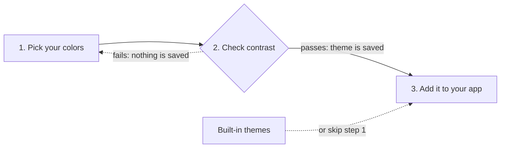

# Theme Service overview

The live version of this page, with the themes applied, is at
**<https://kaseycolian.github.io/theme-service/>**.

Theme Service is a skill for Claude Code and other AI agents. It walks you through picking colors for
a theme and checks every color pair against WCAG 2.2 AA. It won't save a theme that fails. Then it
adds your themes to a new or existing app, with a theme picker.

---

## How it works



1. **Pick your colors.** Bring a palette, describe the look you want, or ask for a whole new style.
   The skill asks questions and fills in any colors you leave out. Or skip this and use the built-in
   themes.
2. **Check contrast.** Text, links, buttons and focus rings are checked on every background, in dark
   and light. Text and accent colors need 4.5:1, button labels need 4.5:1 on their fill, and focus
   rings need 3:1. If anything fails, nothing is saved. You adjust the colors and check again.
3. **Add it to your app.** The skill copies the theme files into your repo and adds a theme picker.
   Works with plain HTML and CSS, React and Angular. Your app doesn't need a build step.

## What you can use it for

**Create a theme.** Have brand colors, or just an idea? The skill guides you to a full theme that
passes AA. Your themes live in your own copy of the repo.

> Use the theme-service skill to create a new theme. I'm thinking dark navy with warm orange accents.

**Add themes to an existing app.** Your markup and components stay. The skill replaces hardcoded
colors with theme variables and adds a theme picker. It asks before changing anything bigger.

> Use the theme-service skill to add themes and a theme picker to this app.

**Start a new app on it.** Build on the themes from day one. You get ready-made buttons, form fields,
tabs, alerts and a dropdown that work in every theme.

> Set up this new project with the theme-service skill. Use the component classes and add a theme
> picker.

## Get started

1. Clone the repo:

   ```sh
   git clone https://github.com/kaseycolian/theme-service.git
   ```

2. Install the skill. This links the skill into Claude Code and builds the themes. You need Node.

   ```sh
   cd theme-service
   npm run install-all
   ```

3. Open your app in Claude Code and ask for one of the three things above. Name the skill in your
   request so the agent loads it.

Not using Claude Code? Run `npm run build-themes` instead of `install-all`, then point your agent at
[`AGENTS.md`](../AGENTS.md).

## It asks before it changes your app

For an existing app, the skill checks with you first. Here's what it asks, and what it does if you
don't have a preference.

| Question | Default |
|----------|---------|
| How much should your components change? Colors only, or a full restyle. | Colors only |
| Should it use the theme fonts? | Keep your fonts |
| Where should the background grid go? Page background, header and footer, or both. | Page background |
| Replace your theme picker, or add to it? Keep your old themes? | Only asked if you have one |
| Where should the theme picker go? | It suggests a spot, you confirm |

It saves your answers in `THEME-SERVICE.md`, so later updates follow the same choices.

## What gets added to your repo

The skill copies these into `src/theme/` or `assets/theme/`, depending on your stack. Nothing points
back to this repo, so your app works on any machine.

| File | What it's for |
|------|---------------|
| `theme.css` | Colors for every theme. |
| `effects.css` | The glow and the background grid. |
| `components.css` | Ready-made buttons, form fields, tabs and alerts. New apps, or if you chose a full restyle. |
| `theme-init.js` | Applies the saved theme before the page draws, so it doesn't flash. |
| `theme-select.js` | Fills the theme picker and remembers the choice. Plain HTML apps only; React and Angular apps get a small hook or service instead. |
| `THEME-SERVICE.md` | The version you're on and the choices you made. Updates read it. |

## Staying up to date

- **Update an app.** Ask: *"Update this repo to the latest theme-service version."* New themes show
  up in the app's theme picker.
- **Update your copy of the skill.** Ask: *"Update my theme-service clone from origin."* You get new
  built-in themes and fixes. Themes you made are kept.

---

*More detail:* [README](../README.md) · [USAGE](../USAGE.md) (adding themes to an app) ·
[CREATING-THEMES](../CREATING-THEMES.md) (making themes) · [ARCHITECTURE](../ARCHITECTURE.md) (how it
fits together).
